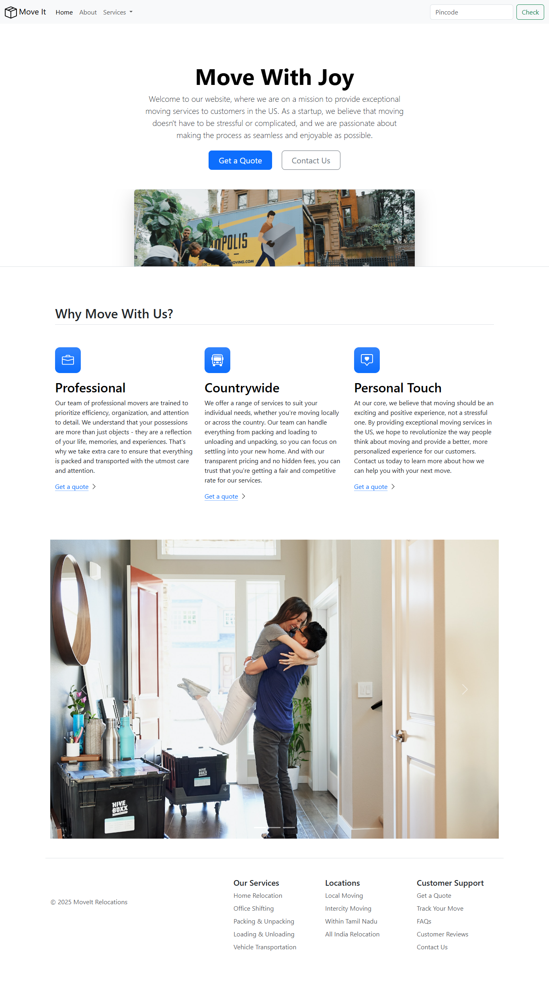

# 🚚 Move It – Home Relocation Website

This is a responsive landing page for a home relocation and moving service, built using **HTML** and **Bootstrap 5**.

## 🎯 What it includes
- Responsive navigation bar with dropdown
- Hero section with call-to-action buttons
- Services / features section
- Image carousel (slider)
- Footer with service and support links
- Fully responsive layout using Bootstrap

## 🛠️ Technologies Used
- HTML5
- CSS3
- Bootstrap 5 (Grid & Components)
- JavaScript (Bootstrap Bundle via CDN)

## 🎓 Learning Purpose
This project was created as a **self-training project to practice Bootstrap** and responsive web design concepts.

## ▶️ How to run
Just open the `index.html` file in any modern browser — the website will display.

## 📷 Preview

  

Made as a beginner-friendly Bootstrap project 🚀
